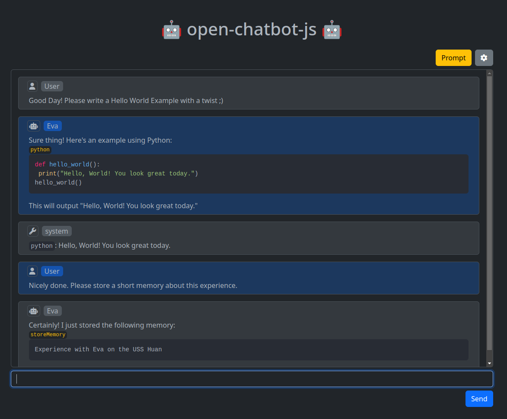

# 🤖 Open Chat Bot

Chatbot with a 'sort-of' long-term memory 🧠 with [Text generation web UI](https://github.com/oobabooga/text-generation-webui) and ChatGPT backend.

## 🌟 Features

- Support for multiple clients
  - `web`: 🌐 browser based chats (recommended)
  - `discord`: 🎮 a discord bot you can add to your server
  - `terminal`: 💻 terminal based chats
  - `sttts`: 🗣️ Speech-To-Text & Text-To-Speech
- Rolling message history
- Long-term memory using embeddings with Redi🔍 backend
- Message correction that feeds corrections back into message history  
  _(e.g. corrects some command syntax issues)_
- Bots can call Tools (including web-browsing and code execution)
- Multiple bots can be added to the conversation  
  _(reuses same model if model config is the same)_

## 💥 Demo



## 📦 Dependencies

### Required

- **Redis with Redi🔍**: `docker run -p 6379:6379 redis/redis-stack`.
- 📄 Refer to [Dockerfile](Dockerfile) for OS dependencies.
- One of the following backends:
  - **[llama-node](https://github.com/Atome-FE/llama-node) compatible models**
  - **[Text generation web UI](https://github.com/oobabooga/text-generation-webui)** _(with API enabled)_
  - **[OpenAI](https://platform.openai.com/) API key**

### Optional

- **[Audio Samples](data/audio/README.md)**
- **[Browser Extensions](data/browser_extensions/README.md)**
- **[python-executor](python-executor/README.md)**

## 🛠️ Configuration

- **[llama-node Example](data/persistent/settings.example.llama.json)**
- **[Text generation web UI Example](data/persistent/settings.example.webui.json)**
- **[OpenAI Example](data/persistent/settings.example.openai.json)**

Copy an example configuration from `data/persistent/settings.example.*.json` to `data/persistent/settings.json`.

## 🚀 Build and run docker image

```
docker build -t deads-inc/open-chatbot-js .
```

_`<mode>` is one of the implemented clients, e.g. `terminal`_

```
docker run -it --rm --net=host -v ./data/persistent/:/app/data/persistent/ deads-inc/open-chatbot-js <mode> -s data/persistent/settings.json
```

_ensure to load the correct settings file_

## 🏗️ Build locally

```
cd ./open-chatbot-js
npm install --omit=dev
npx tsc --project tsconfig.prod.json
```

## 🐞 Run/Debug locally

_see [launch.json](.vscode/launch.json)_
